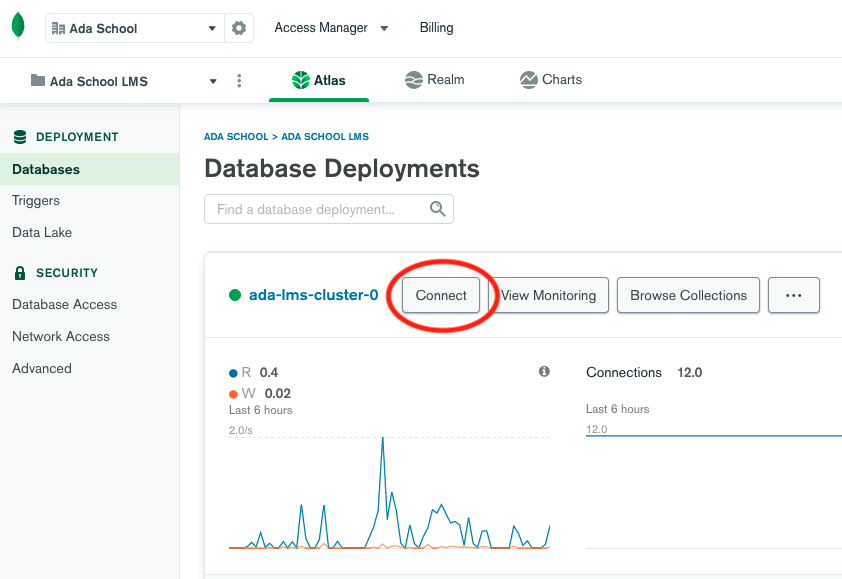
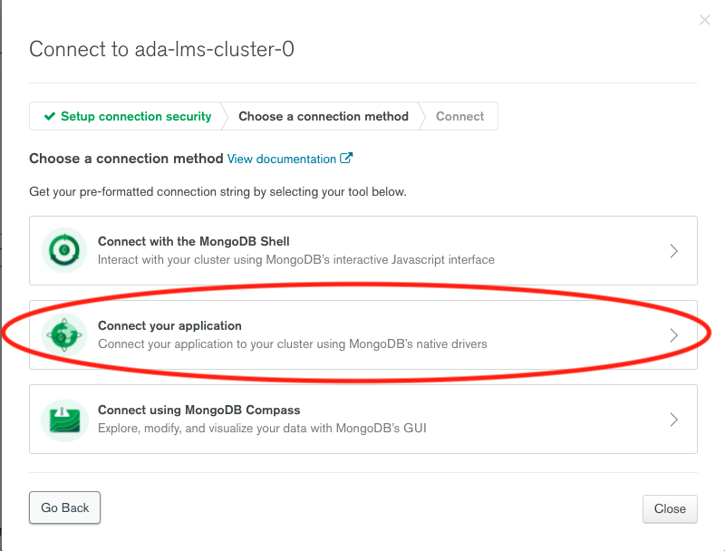
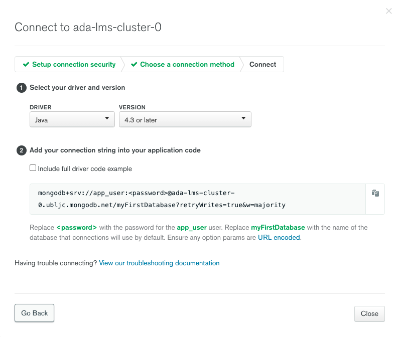
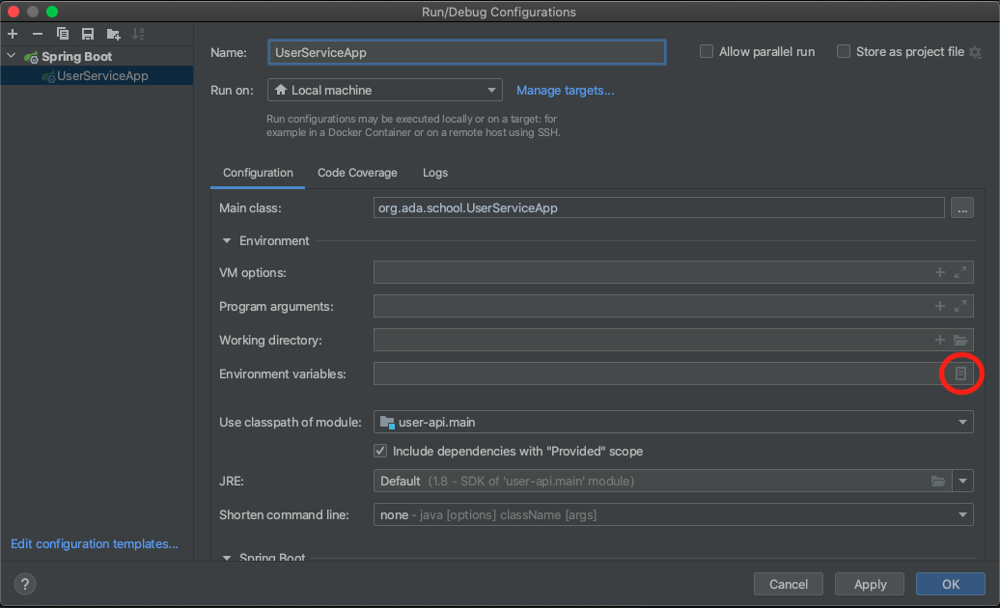
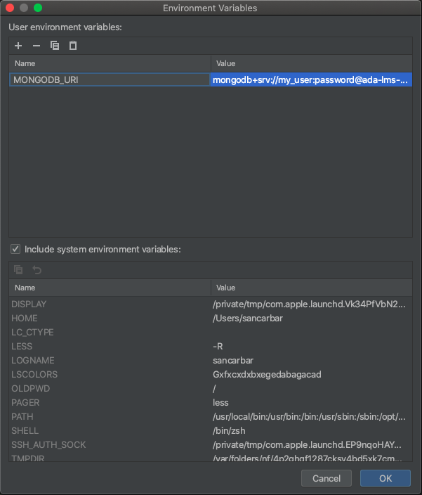

## Spring Boot Data with MongoDB

**Learning Objectives**

- Explain what MongoDB is.
- Explain the difference between SQL and NoSQL.
- Create a MongoDB Cluster on Atlas.
- Connect your Spring Boot project with a MongoDB Cluster.


## Detail Orientation 🤹🏽

Read the following document [Attention to details)[https://www.csu.edu/humanresources/empdev/documents/AttentiontoDetail.pdf] 

**Main Topics**

* NoSQL.
* MongoDB.
* Cluster.

## Codelab 🧪

🗣️ "I hear and I forget I see and I remember I do and I understand." Confucius

### Part 1: Creating your Atlas account and first cluster:

If you haven't created your MongoDB Cluster follow part 1 - 4:

* [Get Started with Atlas](https://docs.atlas.mongodb.com/getting-started/)

### Part 1: Connecting my MongoDB Cluster with Spring Boot

1. Login into your [MongoDB Atlas account](https://account.mongodb.com/account/login)
2. Click *connect* on the cluster you created on Part 1:
   
3. Select *Connect your application*:
   
4. Choose the *Java* driver, select the latest version and copy the *connection string*:
   
5. Replace the *password* on the *connection string* with the password used when creating your database user.
6. Add an *Environment Variable* to the *application.properties* file to store the MongoDB URI:
    ````properties
    spring.data.mongodb.uri=${MONGODB_URI}
    ````
7. Add the environment variable to IntelliJ Idea by editing the Run/Debug Configurations:
   
   
   
   
7. Add the Spring Boot starter data MongoDB dependency to your *build.gradle*:
    ```groovy
       dependencies {
            implementation 'org.springframework.boot:spring-boot-starter-web'
            implementation 'org.springframework.boot:spring-boot-starter-data-mongodb'
            testImplementation 'org.springframework.boot:spring-boot-starter-test'
        }
    ```
8. Run your project and verify that the connection is successful.

**Java:**

 ```java
     public interface UserService
{
   User create( User user );

   User findById( String id );

   List<User> all();

         void deleteById( String id );

         User update( User user, String userId );
     }
  ```
  **Kotlin:**
  ```kotlin
      interface UserService {

         fun create( user: User): User

         fun findById( String id ): User?
         
         fun  all(): List<User>

         fun deleteById( String id )

         fun update( User user, String userId ): User

      }
  ```

